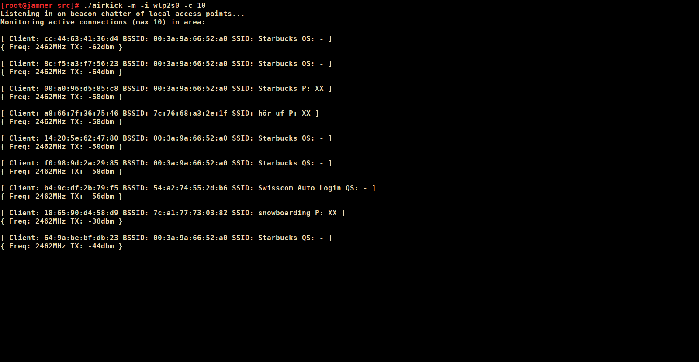
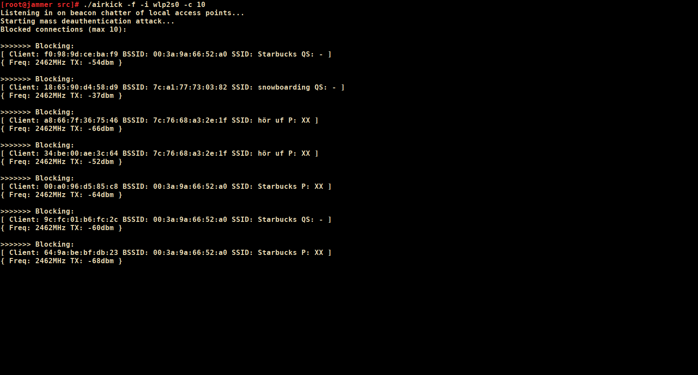

# airkick
C implementation of the classic WLAN deauthentication attack.

[Prerequisites](#Prerequisites)

[Installation](#Installation)

[Usage](#Usage)

[Screenshots](#Screenshots)

[Limitations](#Limitations)

## The Hell Is This??
This is a commandline tool that can perform the infamous
wifi [deauthentication attack](https://en.wikipedia.org/wiki/Wi-Fi_deauthentication_attack). 
Currently there are three modes of operation:

1. Discovery of active wifi sessions in the vicinity.
2. Deauthentication of a single client.
3. DoS-style mass deauthentication of all discovered sessions.

The program uses the standard pcap routines to read packets from a capture interface
and write forged ones to the wire. Mode 1 implements a minimal parser with the purpose
of identifying potential targets. Mode 3 builds on mode 1 by additionally dispatching 
frame injection threads for every connection discovered.

## Prerequisites
This program was designed for Linux platforms, other operating systems are not supported.

##### Hardware requirements
Your wireless card should support capturing packets in [promiscuous mode](https://en.wikipedia.org/wiki/Promiscuous_mode) 
as well as packet injection, ideally **at the same time**. Otherwise errors are likely to occur.

##### Library Dependencies
* [iwlib](https://hewlettpackard.github.io/wireless-tools/Tools.html) from wireless tools *(for scanning and some other stuff)*.
* [libpcap](http://www.tcpdump.org/) *(packet capture and injection)*.
* [libnet](https://sourceforge.net/projects/libnet-dev/) *(currently only used for the CRC checksum)*.

Additionally, the parallelism of mode 3 is implemented via Posix Threads. So make sure an implementation
of the pthreads API is present.

## Installation
This project is built with the \*shivers\* [autotools](http://www.gnu.org/software/autoconf). Download the sources from
the [Release](https://github.com/Van-Ziegelstein/airkick/releases) page and cd into the unpacked directory. Then initialize, configure and make:

``` 
autoreconf -i
./configure
make
```


## Usage
The program is meant to be run from the commandline. You will most likely need elevated privileges in order
to create and perform I/O operations on the pcap pseudo-interfaces. You can toggle between the different
modes by supplying the appropriate parameter:

#### -m 
Monitoring active sessions that are close by. Command format:

`airkick -m -i <myNIC> [ -c max_connections ] [ -t active|passive ]`

The program will first perform a scan (via iwlib) to get a list of the
local access points. It will then watch for data frames sent to the stations
and print the source mac addresses to the console.

#### -d
Deauthentication of a single client device. Command format:

`airkick -d -i <myNIC> -s <spoofed client mac> -b <bssid>` 

This mode can be used to target a single machine whose mac address is already known.
`<spoofed client mac>` should be a string of the form `XX:XX:XX:XX:XX:XX`. Likewise, `<bssid>` 
is supposed to be the mac address of the access point (in the same format).

#### -f
Automatic deauthentication of all discovered sessions. Command format:

`airkick -f -i <myNIC> [ -c max_connections ] [ -t active|passive ]`

This mode acts as an extension of the watch functionality. 
Instead of just monitoring data frames, the program will actively block clients at first sight. 
Each target gets assigned to its own thread with separate pcap handles and packet buffers.

**Warning:** This mode is anything but subtle. Unless the local network admins are on vacation
(and have taken the entire IDS with them) there's no way that sudden deauthentication flood will
pass unnoticed.

#### Options

###### Required
* `-i <myNIC>`: This parameter is mandatory for all three modes and determines which wireless card to use.
*myNIC* should be the device name as it appears in ifconfig/ip, e.g. `wlan0`.  

###### Optional
* `-t passive|active`: This determines whether iwlib should conduct a passive or active scan. The passive scan has the
advantage of being "listen only", so no probe requests are sent to APs. Thus the mac address of the
attacking machine should not show up in any log files. However, scan results will likely be less 
comprehensive than with the active counterpart.

   By default, an active scan is performed.

* `-c max_connections`: When using mode 1 or 3, *airkick* limits itself to a conservative default 
(tweakable at compile time) of tracked connections. This parameter can be used to increase
the tracking limit. Beware, though, that the impact of doing so might be significant, especially
in flood mode (Every thread gets its own packet buffer and pcap handle). Use this option at your own risk.

## Screenshots

| Finding active connections | 
| --- |
|  | 

| Cleansing the air |
| --- |
|  |


## Limitations

* *airkick* is by no means a complete wireless suite. If you need complete wireless auditing functionality, a tool
like [aircrack-ng](https://www.aircrack-ng.org/) will serve you far better than this steaming pile of code.

* The program's injection capabilities are (for now) limited to deauthentication frames. Disassociation frames are not
covered.

* It might be possible to build this tool on BSD systems, but no testing has been done so far.

* With the (not so) recent [updates](https://en.wikipedia.org/wiki/IEEE_802.11w-2009) to the IEEE 802.11 standard and 
WPA3 on the horizon *airkick* might already be obsolete. Of course, protocol updates always carry with them a chance
of new loopholes (which translates to feature extensions for projects like this). Still, the wifi landscape is ever changing 
and in its current shape this little toy might soon be a relic of the "good old days".

## Authors
**Van Ziegelstein** - Creator and Maintainer

## License
This project is licensed under the [GPL](COPYING).
